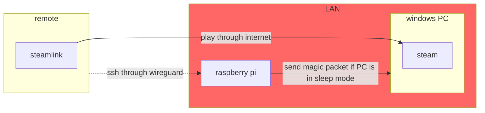
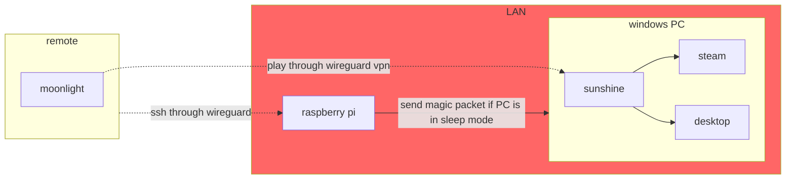

+++
title = 'Play steam games remotely using moonlight/sunshine or steam link and wake-on-lan'
date = 2024-07-28T12:29:43+02:00
tags = ['steam', 'remote', 'steamlink', 'wake-on-lan', 'wireguard']
ShowReadingTime = true
[editPost]
URL = "https://github.com/ftith/ftith.github.io/edit/main/content"
Text = "Suggest Changes"
appendFilePath = true
+++
## Goal
My goal here is to be able to play remotely from a portable device (laptop, tablet or phone) on my PC with a graphic card.


I used **steamlink** first to play through the Internet. It worked well and did not need to have additional setup (no vpn or additional port in/out manual setup on my computer or router). 

Unfortunately, on my last macOS update, steamlink kept crashing after the update. I had no other to give up and look up for another alternative. I've tried:
- Teamviewer:
  - advantage: simple and quick setup
  - drawbacks: 
    - Close source 
    - Issue in terms of performance for gaming
    - Major issue: no possiblity to self host
- **rustDesk**:
  - advantages: 
    - Opensource 
    - Self-host (I was able to use it with a VPN) AND through their servers
  - drawbacks: 
    - Setup using rustDesk servers is apparently not very good in terms of performance (not tested myself though)
    - Setup was a bit quirky for self-host setup (and I wanted it this way since it is more secure)
    - Major issue on gaming: https://github.com/rustdesk/rustdesk/issues/2525
- **Windows Remote Desktop**
  - advantage: Coming with Windows so no additional setup needed (if you have professional Windows)
  - drawback: 
- **Moonlight**

Finally, I wanted my computer to be able to go to sleep to save energy and be able to wake it up remotely outside LAN. I needed a solution to send magic packet (**wake on lan**) _safely_ so **Wireguard VPN** comes in action. 


**My steamlink setup:**

**My moonlight/sunshine setup:**

## Setup steps
1. Create a dynDNS address on for instance https://www.noip.com/ [[1]](#1-how-to-install-wireguard-on-raspberry-pi-using-pivpn-httpsraspberrytipscominstall-wireguard-raspberry-pi)
1. Setup your dynDNS on your router [[1]](#1-how-to-install-wireguard-on-raspberry-pi-using-pivpn-httpsraspberrytipscominstall-wireguard-raspberry-pi)
1. Install wireguard on your raspberry using piVPN
1. Install wireguard "client" on your remote device
1. Install wakeonlan command on raspberry pi
```
sudo apt install etherwake
```
## Steps to run when your PC is sleep mode
1. Connect to LAN using wireguard
2. SSH to your raspberry pi using wireguard IP
2. Send magic package to your PC from raspberry pi
```
wakeonlan <PC mac address>
```
3. Start steamlink on your client and connect to your PC

## Sources
- #### [1] How to install wireguard on raspberry pi using piVPN https://raspberrytips.com/install-wireguard-raspberry-pi/
- #### [2] How to configure dynDNS on a livebox (French) https://communaute.orange.fr/t5/Trucs-et-astuces/Livebox-Comment-y-acc%C3%A9der-depuis-Internet/ta-p/635954
- #### [3] How to send a magic packet: https://www.cyberciti.biz/tips/linux-send-wake-on-lan-wol-magic-packets.html